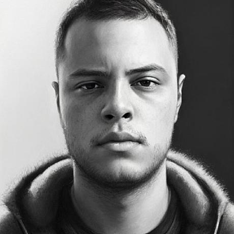

# Especificações do Projeto

Pré-requisitos: <a href="1-Documentação de Contexto.md"> Documentação de Contexto</a>

## Personas

Para levantamento das Personas, foi realizadada a [Pesquisa - Perfil de investidor](https://docs.google.com/forms/d/e/1FAIpQLSfjqRgOiBQSQ025G97otpiJ7b3VG3CxzBuqh_xigACh5arYlA/closedform), por meio do Google Forms, no período de 24/03/2023 a 28/03/2023.

Abaixo são apresentados alguns dos perfis que responderam ao questionário, e que são representativos da amostra coletada.

|                                                                             |                                                                                 |
|-----------------------------------------------------------------------------|---------------------------------------------------------------------------------|
|                 | **Lucas Guimarães**                                                             |
| **Idade:** Entre 19 e 24 anos **Ocupação:** Empregado no setor privado   | **Aplicativos:** Redes sociais Comunicação Transporte Serviços Financeiros   |
| **Motivações:** Reserva de emergência Fonte de renda extra Aposentadoria | **Frustrações:** Instabilidade política prejudicar investimentos       |
|                   | **Pedro Willian**                                                               |
| **Idade:** Entre 19 e 24 anos **Ocupação:** Empregado no setor privado   | **Aplicativos:** Serviços Financeiros Outros                        |
| **Motivações:** Lazer                                                    | **Frustrações:** Não informou                                                |
|                    | **Bárbara Sena**                                                                |
| **Idade:** Entre 25 e 39 anos **Ocupação:** Empregado no setor privado   | **Aplicativos:** Redes sociais Comunicação Transporte Serviços Financeiros   |
| **Motivações:** Lazer Reserva de emergência Viagens Aposentadoria     | **Frustrações:** Investir errado e perder dinheiro                     |
|                  | **Fernando Alves**                                                              |
| **Idade:** Entre 25 e 39 anos **Ocupação:** Profissional Liberal         | **Aplicativos:** Comunicação Serviços Financeiros|
| **Motivações:** Comprar/reformar imóvel ou comprar/trocar o carro Fonte de renda extra Aposentadoria| **Frustrações:** Instabilidade política prejudicar investimentos|
|            | **Luciano Bragatto**                                                          |     
| **Idade:** Entre 40 e 59 anos **Ocupação:** Empregado do setor público    | **Aplicativos:** Comunicação Serviços Financeiros                  |       
| **Motivações:** Lazer Consumo de bens e serviço Reserva de emergência Viajens   | **Frustrações:** Variaçao de mercado                         |
|                  | **Ahyla Cabral**                                                                |       
| **Idade:** Entre 19 e 24 anos **Ocupação:** Empregado no setor privado     | **Aplicativos:** Redes Comunicação sociais Comunicação Transporte Serviços Financeiros  |
| **Motivações:** Lazer Reserva de emergência Viagens Aposentadoria       | **Frustrações:** Investir errado e perder dinheiro e o cenário político atrapalhar|
 
## Histórias de Usuários

Com base na análise das personas forma identificadas as seguintes histórias de usuários:

|EU COMO... `PERSONA`| QUERO/PRECISO ... `FUNCIONALIDADE`            |PARA ... `MOTIVO/VALOR`                              |
|--------------------|-----------------------------------------------|-----------------------------------------------------|
|Usuário do sistema  | Cadastrar minhas carteiras de investimentos   | Para acompanhar meus objetivos financeiros          |
|Usuário do sistema  | Cadastrar meus ativos                         | Para acompanhar o rendimento da carteira            |
|Usuário do sistema  | Cadastrar minhas negociações                  | Para apurar imposto de renda devido                 |
|Administrador       | Alterar permissões                            | Permitir que possam administrar contas              |
|Usuário do sistema  | Cadastrar as variações do mercado             | Encontrar padrões e vizualizar melhor as mudanças   |
|Usuário do sistema  | Cadastrar minhas perdas e investimentos       | Para acompanhar minhas perdas e ganhos              |

## Requisitos

As tabelas que se seguem apresentam os requisitos funcionais e não funcionais que detalham o escopo do projeto.

### Requisitos Funcionais

|ID    | Descrição do Requisito  | Prioridade |
|------|-----------------------------------------|----|
|RF-001| O site deve permitir ao usuário a criar uma conta e configurar carteiras para investimentos | ALTA | 
|RF-002| O site deve permitir ao usuário fazer login em sua conta, configurar e editar seu perfil | MÉDIA |
|RF-003| O site deve permitir ao usuário adicionar, remover e editar seus ativos a qualquer instante. Além disso, visualizar detalhes de duas carteiras e de seus ativos | MÉDIA |
|RF-004| O site deve exibir gráficos com às variações das carteiras e dos ativos | MÉDIA |
|RF-005| O site deve exibir gráficos com às variações de saldo do usuário | MÉDIA |
|RF-006| O site deve exibir ao usuário os impostos que vão ser gerados pelos seus ativos | MÉDIA |
|RF-007| O site deve exibir gráficos dos rendimentos ou perdas do usuário | MÉDIA |
|RF-008| O site deve permitir ao usuário importar notas de corretagem ou importar arquivo CSV ou planilha eletrônica com registro das negociações, ou registrar manualmente as negociações | ALTA |

### Requisitos não Funcionais

|ID | Descrição do Requisito  |Prioridade |
|------|-----------------------------------------|----|
|RNF-001| O sistema deve ser responsivo para rodar em um dispositivos móvel | MÉDIA | 
|RNF-002| Deve processar requisições do usuário em no máximo 3s |  BAIXA | 
|RNF-003| O site deve ser publicado em um ambiente acessível publicamente na Internet (Repl.it, GitHub Pages, Heroku) | ALTA |
|RNF-004| O site deve ter bom nível de contraste entre os elementos da tela em conformidade | MÉDIA |
|RNF-005| O site deve ser compatível com os principais navegadores do mercado (Google Chrome, Firefox, Microsoft Edge) | ALTA |
|RNF-006| O site deve conter acessibilidade digital para que todos os grupos de pessoas possam perceber, entender, navegar e interagir de maneira efetiva com as páginas | ALTA |

## Restrições

O projeto está restrito pelos itens apresentados na tabela a seguir.

|ID| Restrição                                             |
|--|-------------------------------------------------------|
|RE-01| O projeto deverá ser entregue no final do semestre letivo, não podendo extrapolar a data de 07/07/2023 |
|RE-02| O aplicativo deve se restringir às tecnologias básicas da Web no Frontend |
|RE-03| A equipe não pode subcontratar o desenvolvimento do trabalho.   |
