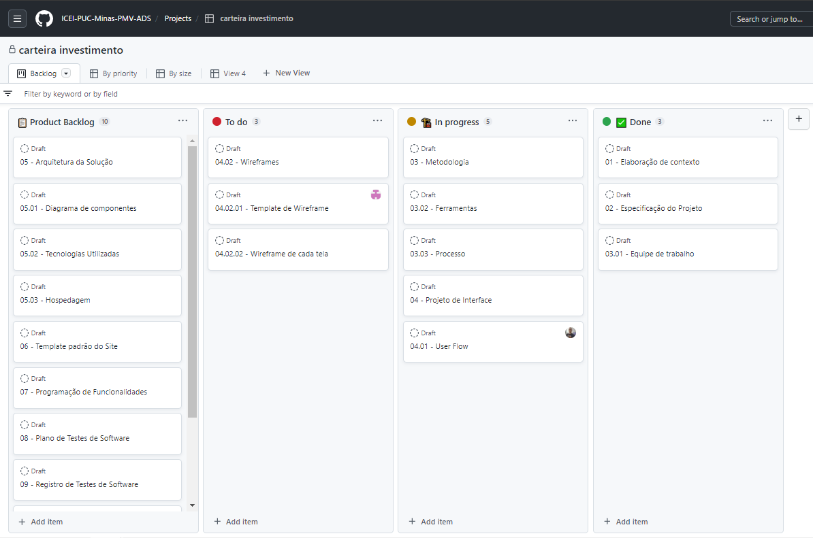

# Metodologia

Pré-requisitos: <a href="2-Especificação do Projeto.md"> Documentação de Especificação</a>

A equipe utiliza metodologias ágeis, tendo escolhido o Scrum como base para definição do processo de desenvolvimento.

## Gerenciamento de Projeto

### Divisão de Papéis

A equipa está organizada da seguinte maneira:
- `Scrum Master`: Pedro Willian Martins Rodrigues De Franca
- `Product Owner`: Marco De Pereira Binda
- `Equipe de Desenvolvimento`: Caê Moreira Euphrásio, Lucas Marinho Ribeiro Guimarães, Paulo Henrique Da Cruz Alves
- `Equipe de Design`: Ahyla De Jesus Cabral
 
### Ferramentas

As ferramentas empregadas no projeto são:

| **Ambiente** | **Plataforma** | **Link de acesso** |
|:----|:---|:-----|
| Comunicação | Teams   Whatsapp | https://teams.microsoft.com/   https://www.whatsapp.com/ |
| Documentos do Projeto | Github   Sharepoint | https://github.com/   https://sgapucminasbr.sharepoint.com/ |
| Editor de código | Visual Studio Code | https://code.visualstudio.com |
| Gerenciamento do Projeto | Github | https://github.com/ |
| Pesquisa | Formulários do Google | https://drive.google.com/ |
| Projeto de Interface e Wireframe | Figma | https://www.figma.com/ |
| Respositório do Código Fonte | Github | https://github.com/ |
| User Flow | draw.io | https://www.diagrams.net/ |

O Teams será usado para videoconferências das reuniões de planejamento do sprint, backlog do sprint, revisão do sprit e revisão do sprint. O Whatsapp para comunicações pontuais no decorrer do dia.

A documentação do projeto ficará hospedada no Github, em razão da facilidade de acesso por parte dos integrantes da equipe. Nos casos em que houver necessidade de documentos mais elaborados (apresentações, planilhas, etc), será utilizado o Office 365, com hospedagem no Sharepoint. Da mesma forma serão utilizadas as ferramentas de gerenciamento de projeto da plataforma, bem como a mesma também servirá de repositório para o código fonte, em razaão de suas funcionalidades de controle de versão.

Para edição de código, foi escolhida a ferramenta Visual Studio Code por: 1) ser gratuita e opensource; 2) ser amplamente  utilizada; 3) possuir um extenso marketplace de addins que possibilitam expandir suas funções, inclusive integrando com o sistema de controle de versões.

### Processo

Para a organização e distribuição das tarefas do projeto, o grupo esta utilizando o GitHub, seguindo os critérios de:
- `Product Backlog`: recebe as tarefas a serem trabalhadas e presenta o Backlogdo produto. Todas as atividades identificadas no decorrer do projeto são incorporadas a esta lista.
- `To Do`: esta lista representa o Sprint Backlog que está sendo trabalhado.
- `In progress`: lista das tarefas iniciadas.
- `Done`: nesta lista são colocadas as tarefas finalizadas e as que passaram pelos testes e controle de qualidade.

#### Backlog em 14/04/2023:

## Controle de Versão

A ferramenta de controle de versão adotada no projeto foi o [Git](https://git-scm.com/), sendo que o [Github](https://github.com) foi utilizado para hospedagem do repositório.

O projeto segue a seguinte convenção para o nome de branches:

- `main`: versão estável já testada do software
- `unstable`: versão já testada do software, porém instável
- `testing`: versão em testes do software
- `dev`: versão de desenvolvimento do software

Quanto à gerência de issues, o projeto adota a seguinte convenção para etiquetas:

- `documentation`: melhorias ou acréscimos à documentação
- `bug`: uma funcionalidade encontra-se com problemas
- `enhancement`: uma funcionalidade precisa ser melhorada
- `feature`: uma nova funcionalidade precisa ser introduzida