# Projeto de Interface

Estamos enfatizando atributos importantes na criação da interface do sistema, como agilidade, acessibilidade e usabilidade. Como resultado, todas as telas do projeto possuem uma identidade visual consistente, projetadas para funcionar tanto em desktops quanto em dispositivos móveis.

<!-- Pré-requisitos: <a href="2-Especificação do Projeto.md"> Documentação de Especificação</a>

Visão geral da interação do usuário pelas telas do sistema e protótipo interativo das telas com as funcionalidades que fazem parte do sistema (wireframes).

 Apresente as principais interfaces da plataforma. Discuta como ela foi elaborada de forma a atender os requisitos funcionais, não funcionais e histórias de usuário abordados nas <a href="2-Especificação do Projeto.md"> Documentação de Especificação</a>. -->

## User Flow

A figura abaixo ilustra o fluxo de interação do usuário através das telas do sistema. As telas individuais são descritas em detalhes na seção de Wireframes subsequente.

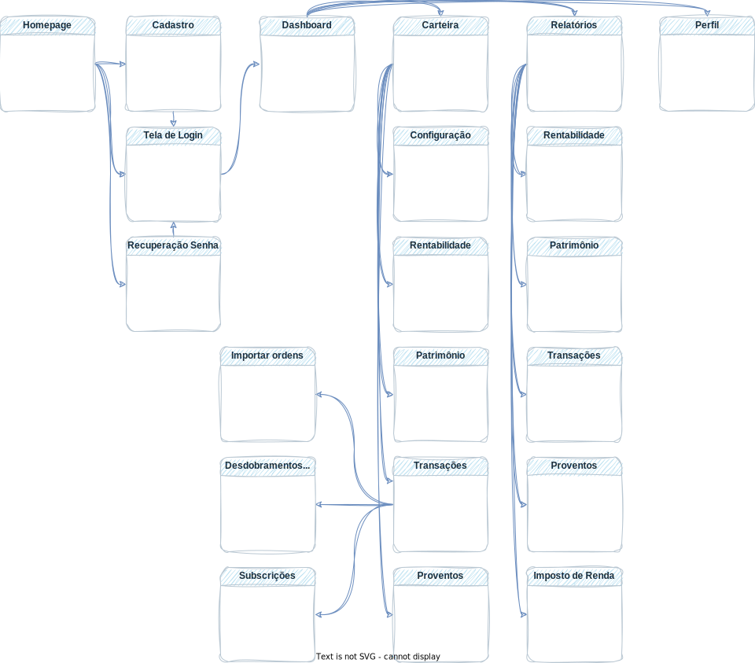

<!-- Fluxo de usuário (User Flow) é uma técnica que permite ao desenvolvedor mapear todo fluxo de telas do site ou app. Essa técnica funciona para alinhar os caminhos e as possíveis ações que o usuário pode fazer junto com os membros de sua equipe.

> **Links Úteis**:
> - [User Flow: O Quê É e Como Fazer?](https://medium.com/7bits/fluxo-de-usu%C3%A1rio-user-flow-o-que-%C3%A9-como-fazer-79d965872534)
> - [User Flow vs Site Maps](http://designr.com.br/sitemap-e-user-flow-quais-as-diferencas-e-quando-usar-cada-um/)
> - [Top 25 User Flow Tools & Templates for Smooth](https://www.mockplus.com/blog/post/user-flow-tools) -->

## Wireframes

As telas do projeto são apresentadas e seguem uma estrutura comum, que consiste em três grandes blocos:
1. Cabeçalho - contém elementos fixos de identidade, como o logotipo, e a navegação principal do site, como o menu da aplicação.
2. Barra lateral - exibe elementos de navegação secundária à esquerda.
3. Conteúdo - apresenta o conteúdo específico da tela em questão.

### Tela - Home Page

A Home Page apresenta opção de login, para usuário já cadastrado, de cadastro, para usuário ainda não cadastrado. Também conta com links para mais informações sobre a características do serviço, planos, FAQ e informações sobre a empresa (âncoras na própria Home - site One page).
 
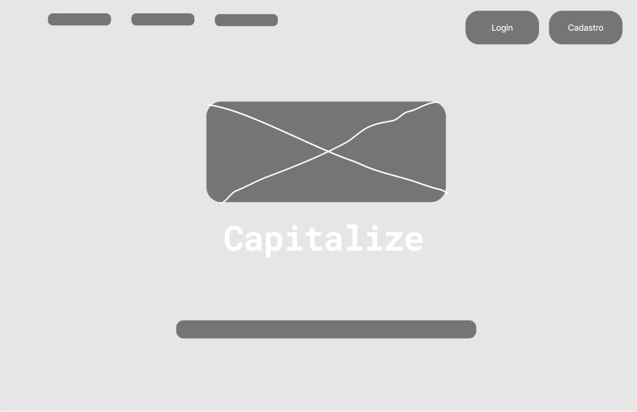

### Tela - Criar Conta

Teste

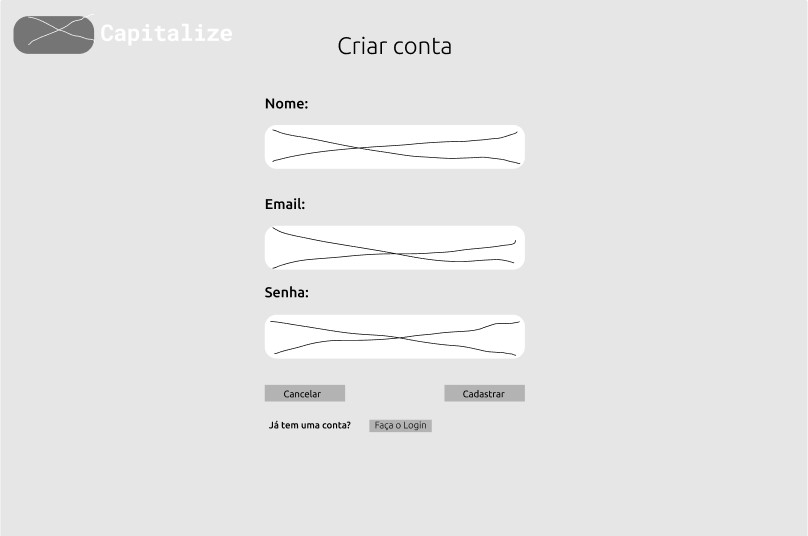
 
### Tela - Fazer Login

Teste

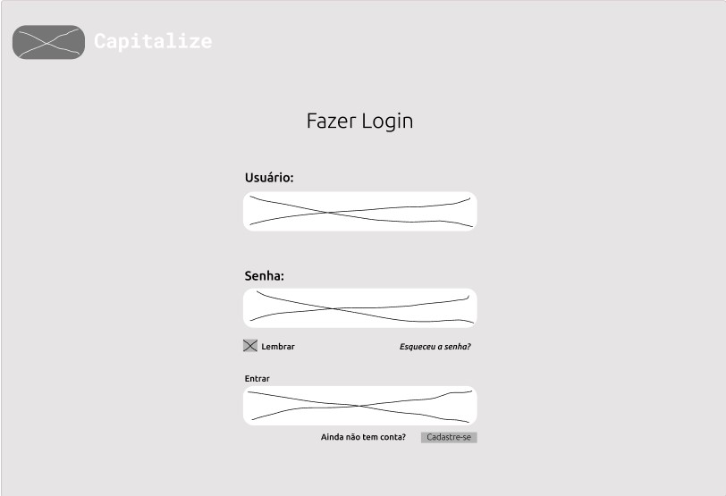
 
### Tela - Redefinir Senha

Teste
 
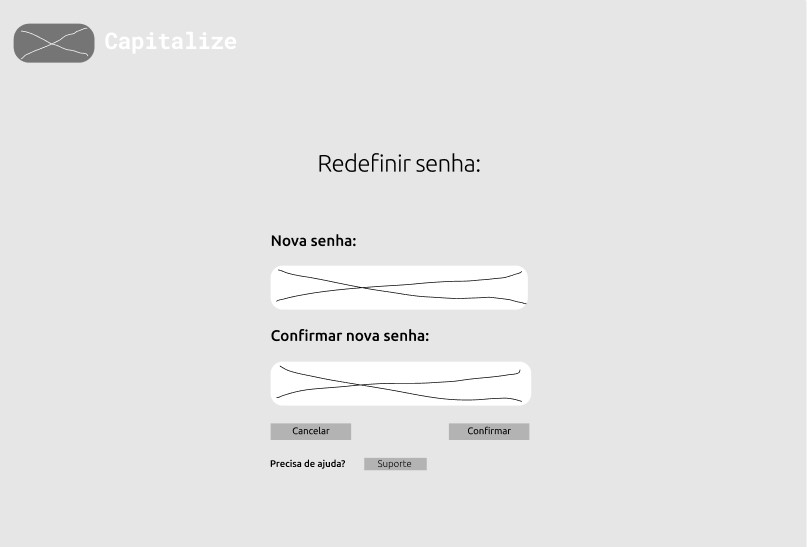

### Tela - Dashboard

Teste
 
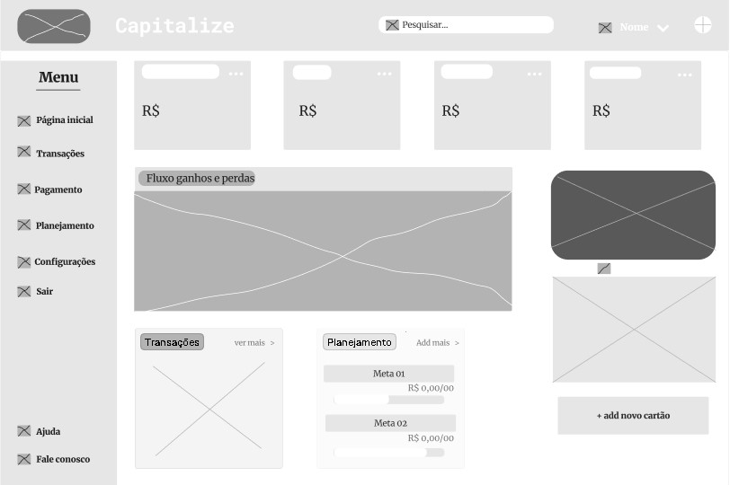
 
### Tela - Perfil

Teste
 
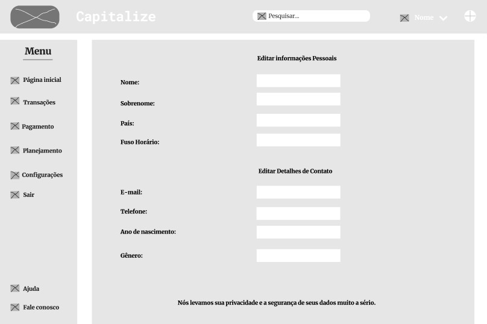
 
### Tela - Configurar Carteira

Teste
 
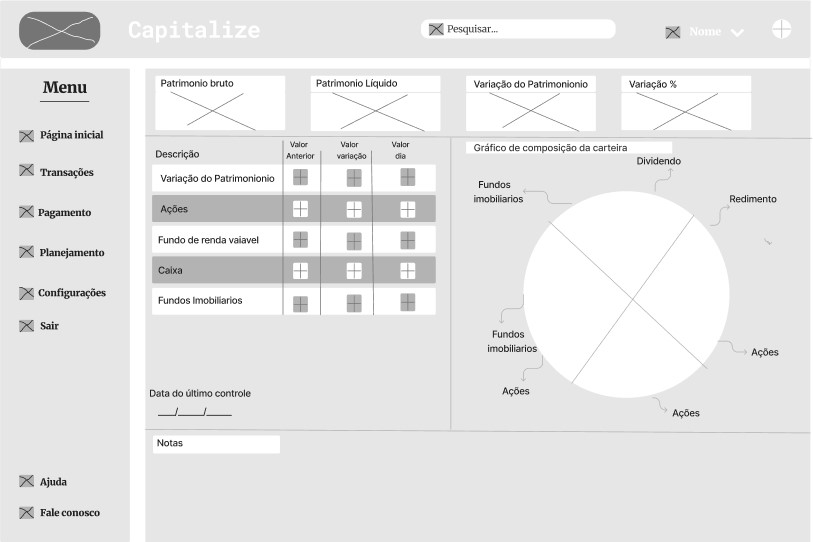
 
### Tela - Configurar Carteira

Teste
 
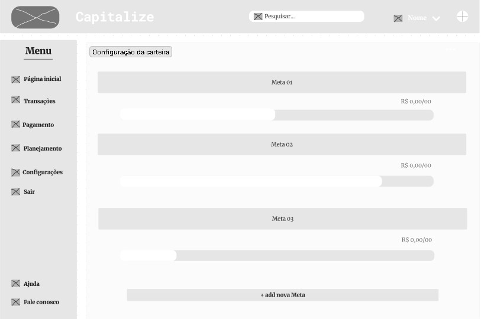
 
### Tela - Proventos

Teste
 
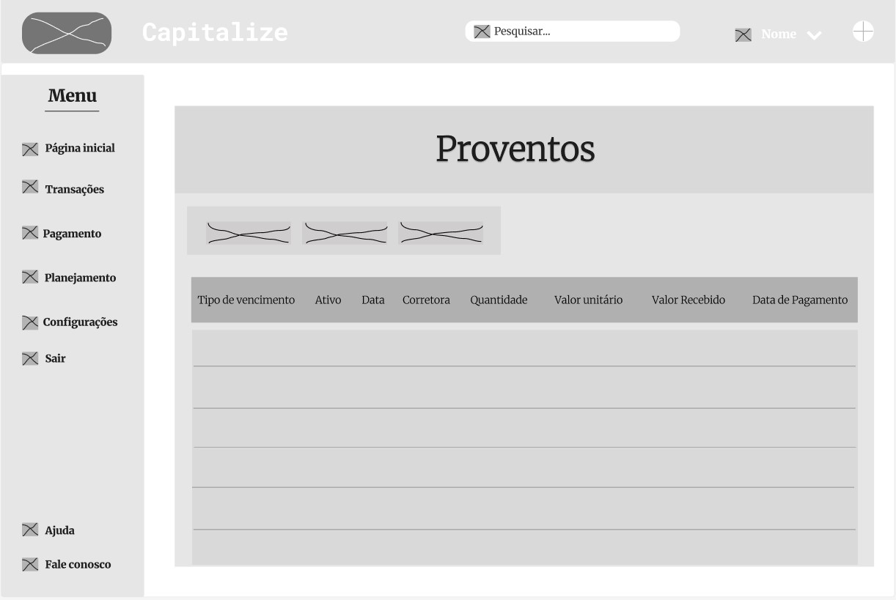
 
### Tela - Evolução Patrimônio

Teste
 

 
### Tela - Imposto de Renda

Teste
 
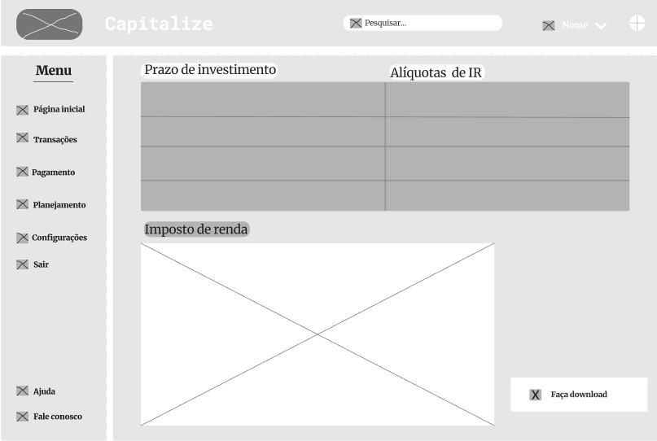
 
<!-- São protótipos usados em design de interface para sugerir a estrutura de um site web e seu relacionamentos entre suas páginas. Um wireframe web é uma ilustração semelhante do layout de elementos fundamentais na interface.
 
> **Links Úteis**:
> - [Protótipos vs Wireframes](https://www.nngroup.com/videos/prototypes-vs-wireframes-ux-projects/)
> - [Ferramentas de Wireframes](https://rockcontent.com/blog/wireframes/)
> - [MarvelApp](https://marvelapp.com/developers/documentation/tutorials/)
> - [Figma](https://www.figma.com/)
> - [Adobe XD](https://www.adobe.com/br/products/xd.html#scroll)
> - [Axure](https://www.axure.com/edu) (Licença Educacional)
> - [InvisionApp](https://www.invisionapp.com/) (Licença Educacional) -->
