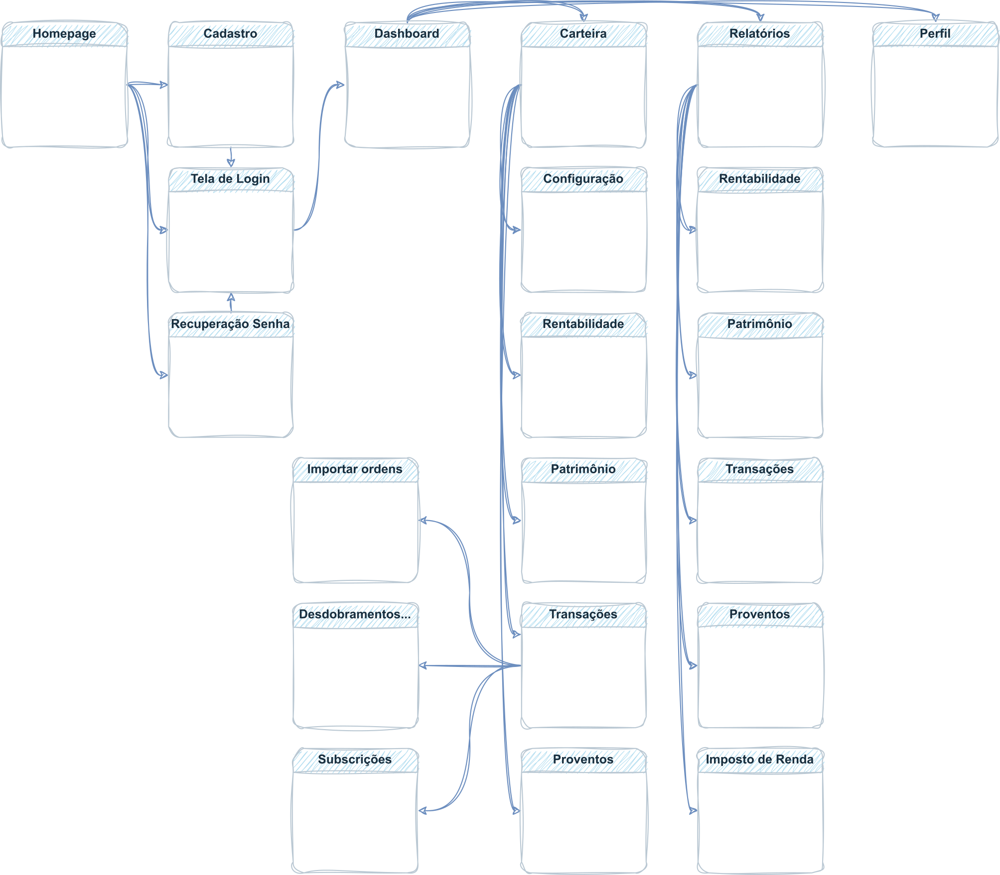

# Projeto de Interface

Estamos enfatizando atributos importantes na criação da interface do sistema, como agilidade, acessibilidade e usabilidade. Como resultado, todas as telas do projeto possuem uma identidade visual consistente, projetadas para funcionar tanto em desktops quanto em dispositivos móveis.

<!-- Pré-requisitos: <a href="2-Especificação do Projeto.md"> Documentação de Especificação</a>

Visão geral da interação do usuário pelas telas do sistema e protótipo interativo das telas com as funcionalidades que fazem parte do sistema (wireframes).

 Apresente as principais interfaces da plataforma. Discuta como ela foi elaborada de forma a atender os requisitos funcionais, não funcionais e histórias de usuário abordados nas <a href="2-Especificação do Projeto.md"> Documentação de Especificação</a>. -->

## User Flow

A figura abaixo ilustra o fluxo de interação do usuário através das telas do sistema. As telas individuais são descritas em detalhes na seção de Wireframes subsequente.

## Wireframes

As telas do projeto são apresentadas e seguem uma estrutura comum, que consiste em três grandes blocos:
1. Cabeçalho - contém elementos fixos de identidade, como o logotipo, e a navegação principal do site, como o menu da aplicação.
2. Barra lateral - exibe elementos de navegação secundária à esquerda.
3. Conteúdo - apresenta o conteúdo específico da tela em questão.

### Telas - Home Page, Criar Conta, Login e Redefinir Senha

A Home Page apresenta opções de direcionamento para login e cadastro e para mais informações sobre a características do serviço, planos, FAQ e sobre a empresa (âncoras na própria Home - site One page). As telas `Criar Conta`, `Fazer Login` e `Redefinir Senha`, exibidas na sequência, podem ser acessadas a partir da Home.

 

 

  

### Tela - Dashboard

Após o login, o usuário é direcionado para a tela Dashboard (template de Wireframe padrão), que apresenta gráficos e informações resumidas sobre o(s) portfólio(s) do usuário. Informações mais detalhadas sobre cada item, bem como geração de relatórios dos mesmos, devem ser buscados nas páginas específicas, por meio do menu lateral.
 

 
### Tela - Carteira

No menu `Carteira` podem ser acessadas as opções referentes à `Configuração`, à `Rentabilidade`, ao `Patrimônio`, às `Transações` e ao `Proventos`, conforme imagens abaixo. 
 

 

 
### Tela - Relatórios 

A partir de cada uma das telas no menu `Carteira` é possível acessar seus respectivos relatórios, exceto o relatório do `Imposto de Renda`, cujo acesso se dá apenas pelo menu `Relatórios`. Neta tela é possível verificar o imposto de renda apurado no exercício e emitir o Documento de Arrecadação de Receitas Federais (DARF) para seu pagamento, bem como exibir relatório para Declaração de Ajuste Anual do Imposto de Renda de Pessoa Física.  
 

### Tela - Perfil

Esta tela permite ao usuário configurar seu perfil e alterar dados cadastrais.

