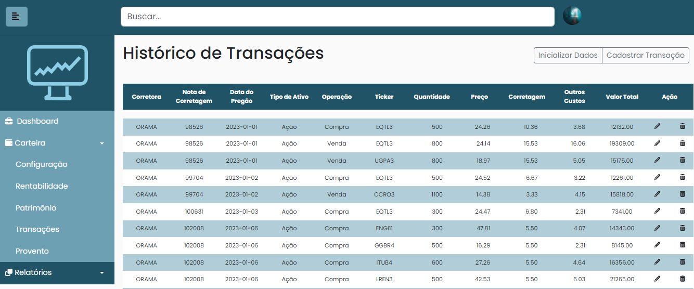
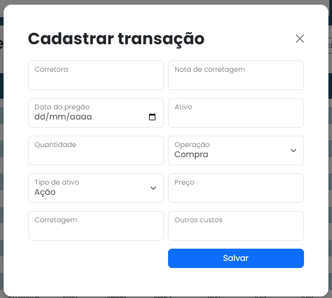
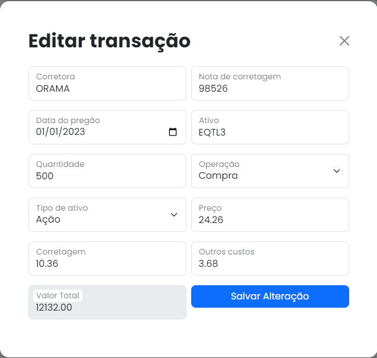
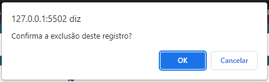
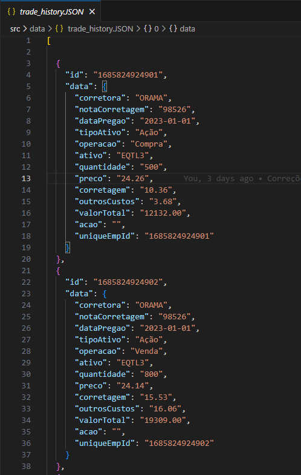
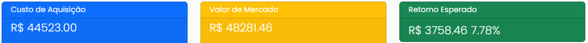
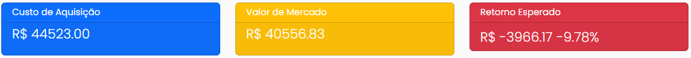
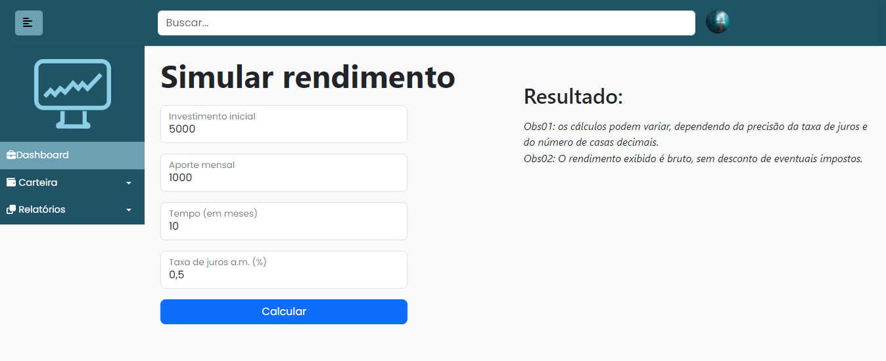
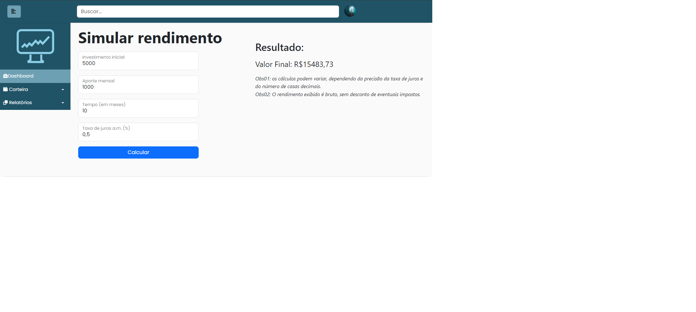

# Programação de Funcionalidades

## RF-001 

### A aplicação deve permitir que o usuário cadastre e gerencie seus investimentos, com informações como valor investido, tipo de investimento, data de vencimento, taxa de juros, etc.

Ao acessar o histórico de transações (menu Carteira > Transações), o usuário tem a opção de carregar uma base de dados de testes no localStorage (botão `Inicializar Dados`). 

O usuário também pode cadastrar transações de forma manual (botão `Cadastrar Transação`).

A partir da tabela de transações, o usuário pode editar os dados (ícone do lápis na coluna `Ação`) ou excluir o registro (ícone da lixeira na coluna `Ação`). 

A estrutura de dados é a seguinte:

#### Artefatos da funcionalidade

- por_transactions.html (Marco de Pereira Binda)

- por_transactions.js (Marco de Pereira Binda)

- por_transactions.css (Marco de Pereira Binda)

- trade_history.JSON (Marco de Pereira Binda)

## RF-002 

### A aplicação deve ser capaz de calcular a rentabilidade dos investimentos cadastrados pelo usuário.

A página Home (Dashboard) exibe o retorno esperado dos ativos que o usuário possui. Para facilitar a leitura, o card muda de cor se o resultadofor positivo (verde) ou negativo (vermelho).

#### Artefatos da funcionalidade

- home.html (Marco de Pereira Binda)

- home.js (Marco de Pereira Binda)

- home.css (Marco de Pereira Binda)

## RF-003 

### A aplicação deve fornecer ferramentas para análise de desempenho dos investimentos, como dashboards, gráficos e relatórios.

#### Artefatos da funcionalidade

- home.html (Marco de Pereira Binda)

- home.js (Marco de Pereira Binda)

- home.css (Marco de Pereira Binda)

## RF-004 

### A aplicação deve permitir que o usuário configure alertas e notificações para acompanhar o desempenho dos seus investimentos, como avisos de vencimento, mudanças nas taxas de juros, etc.

#### Artefatos da funcionalidade

- notification.html (Caê Moreira Euphrásio)

- notification.js (Caê Moreira Euphrásio)

- notification.css (Caê Moreira Euphrásio)

## RF-005 

### A aplicação deve permitir que o usuário simule investimentos futuros, de acordo com diferentes cenários de mercado.

- rentabilidade.html (Caê Moreira Euphrásio)

- rentabilidade.js (Caê Moreira Euphrásio)

- rentabilidade.css (Caê Moreira Euphrásio)
- 
## RF-006 

### A aplicação deve permitir que o usuário visualize seus investimentos realizados em diferentes corretoras.

Ver RF-001 

## RF-007 

### A aplicação deve permitir que o usuário gere a guia de recolhimento e relatórios de demonstrativos de resultados para fins de declaração de imposto de renda.

Pré-requisitos: <a href="2-Especificação do Projeto.md"> Especificação do Projeto</a>, <a href="3-Projeto de Interface.md"> Projeto de Interface</a>, <a href="4-Metodologia.md"> Metodologia</a>, <a href="3-Projeto de Interface.md"> Projeto de Interface</a>, <a href="5-Arquitetura da Solução.md"> Arquitetura da Solução</a>

Implementação do sistema descritas por meio dos requisitos funcionais e/ou não funcionais. Deve relacionar os requisitos atendidos os artefatos criados (código fonte) além das estruturas de dados utilizadas e as instruções para acesso e verificação da implementação que deve estar funcional no ambiente de hospedagem.

Para cada requisito funcional, pode ser entregue um artefato desse tipo

> **Links Úteis**:
>
> - [Trabalhando com HTML5 Local Storage e JSON](https://www.devmedia.com.br/trabalhando-com-html5-local-storage-e-json/29045)
> - [JSON Tutorial](https://www.w3resource.com/JSON)
> - [JSON Data Set Sample](https://opensource.adobe.com/Spry/samples/data_region/JSONDataSetSample.html)
> - [JSON - Introduction (W3Schools)](https://www.w3schools.com/js/js_json_intro.asp)
> - [JSON Tutorial (TutorialsPoint)](https://www.tutorialspoint.com/json/index.htm)
